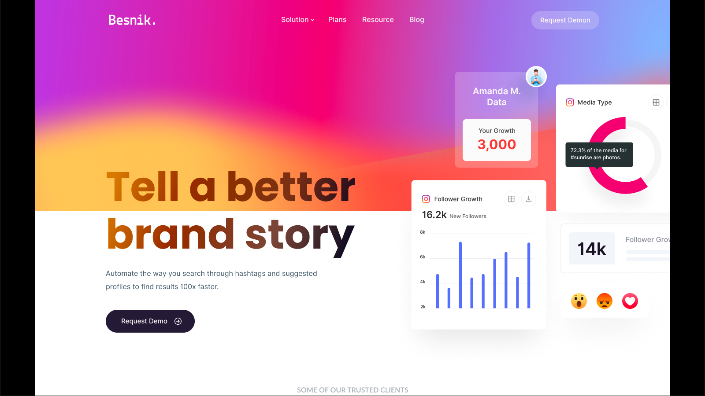

# Figma - Besnik Landing Site

This is a Figma design for the the Besnik landing site Built with Tailwind CSS from scratch.

## Table of contents

- [Overview](#overview)
  - [Screenshot](#screenshot)
  - [What I learned](#what-i-learned)
  - [Continued development](#continued-development)
  - [Useful resources](#useful-resources)
- [Author](#author)

## Overview

### Screenshot

## My process

### Built with

- Semantic HTML5 markup
- CSS custom properties
- Flexbox
- Mobile-first workflow

### What I learned
I learned that a fully fledged site is really hectic from scratch even if You are using a CSS framework and most especially when you are getting the assets from Figma where you have to export almost everything it is really hard to get away with though its great that I did finish it.

### Continued development
I want to continue to update this site to see how better i can build it with better methods and not just just from scratch because if everyone was doing this it would be the most unfavorable thing to do, hence this is a good introduction to Frameworks like React and others but I'm still going to be building projects directly from Figma and coding them from scratch for more experience with Figma a bit and I'm doing the same with JavaScript Projects.

### Useful resources

- [MDN](https://developer.mozilla.org) - This has always been helpful and I will never stop recommending it for css properties as well as Javascript concepts well explained.
- [Tailwind Docs](https://tailwindcss.com) - This has always been helpful and I will never stop recommending it for Tailwind CSS concepts and techniques well explained.

## Author
- Twitter - [@devJhex](https://www.twitter.com/devJhex)
- Instagram - [@devjhex](https://www.instagram.com/devjhex)

